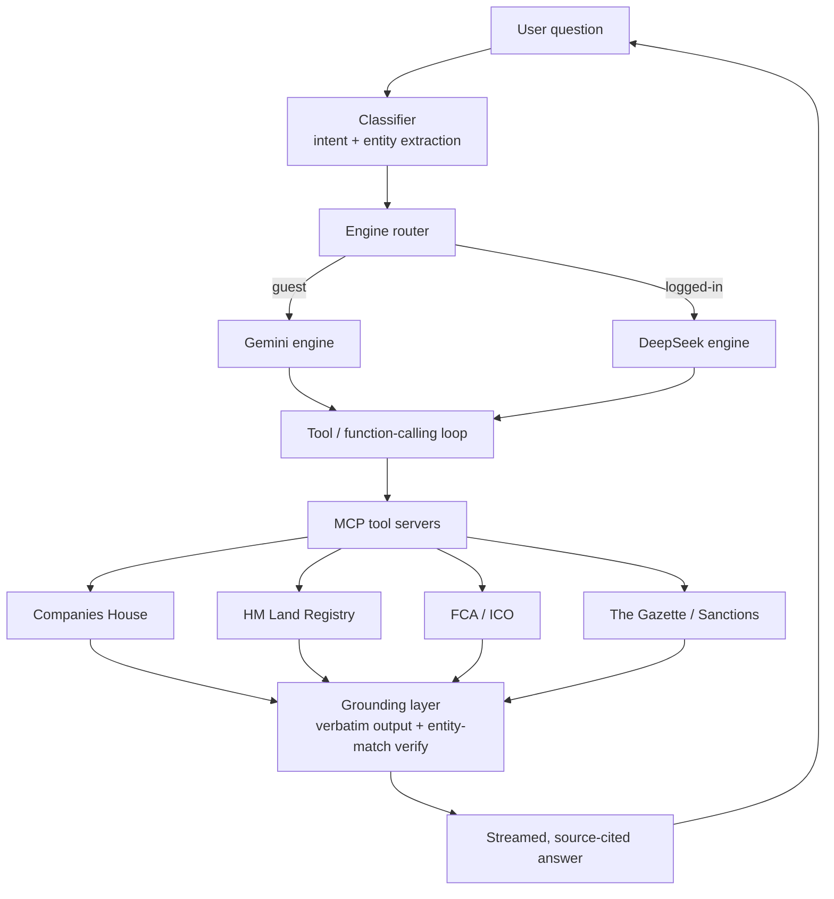

# Verivello — Architecture Case Study

> **How I ground an LLM in official UK registers so it answers company questions with cited sources and does not hallucinate.**

This is a public, code-free architecture write-up of **[Verivello](https://verivello.org)** — a live, production AI agent I designed and built. Ask it anything about any UK company and it returns a plain-English, **source-cited** answer drawn from official registers (Companies House, HM Land Registry, FCA, The Gazette, sanctions lists).

The product is proprietary, so this repo shares the **engineering thinking and system design** — the parts a hiring team actually wants to evaluate — without any product source or secrets.

**Live:** https://verivello.org · **Author:** Azeem Javed ([LinkedIn](https://www.linkedin.com/in/azeem-javed-7666861a/))

---

## The problem

LLMs are fluent but confidently wrong. For company due-diligence, a wrong director, ownership figure or sanctions status is worse than no answer. Companies House alone publishes millions of filings across a dozen registers, all raw. The goal:

> Let a user ask a natural-language question about any UK company and get an answer that is **fast**, **plain-English**, and **provably grounded** in the underlying official records — with **no invented facts**.

---

## System at a glance



---

## The anti-hallucination design (the core idea)

Two rules do most of the work:

**1. Verbatim tool output, not model memory.**
The model is never allowed to *recall* a company fact. Every fact in an answer must come from a tool call whose raw output is passed through unchanged. The model's job is to *explain and cite* retrieved records, not to *know* them.

**2. Entity-match verification.**
Name-search APIs happily return *a* company for a query — often the wrong one. Before any record is used, it is re-verified against the queried entity (number, exact/normalised name, incorporation date). Mismatches are dropped, not shown. Illustrative shape (not product code):

```js
// Reject records that don't actually match the entity the user asked about.
function verifyMatch(query, record) {
  if (query.companyNumber && record.companyNumber)
    return query.companyNumber === record.companyNumber;      // strongest signal
  const a = normalise(record.name), b = normalise(query.name);
  return a === b || (similarity(a, b) >= 0.92 && sameIncorporationYear(query, record));
}
// Only verified records are allowed into the grounded context.
const grounded = toolResults.filter(r => verifyMatch(query, r));
```

If nothing verifies, the agent says so — it does **not** guess.

---

## Key components

| Layer | Responsibility |
|-------|----------------|
| **Classifier** | Extracts intent + the target entity from the question |
| **Engine router** | Picks the response engine per audience (guest vs. logged-in) |
| **Tool / function-calling loop** | Lets the model request exactly the data it needs |
| **MCP tool servers** | Expose each official register as a typed [Model Context Protocol](https://modelcontextprotocol.io) tool (see my companion repo [mcp-uk-tools](https://github.com/cavitnation/mcp-uk-tools)) |
| **Grounding layer** | Verbatim pass-through + entity-match verification |
| **Streaming** | Server-Sent Events so answers render as they generate |
| **Entitlements & billing** | Plan-gated tools/features, Stripe subscriptions with webhook reconciliation |

---

## Engineering decisions worth calling out

- **Grounding over fine-tuning.** Registers change daily; retrieval + verification stays correct without retraining.
- **MCP as the tool boundary.** Each data source is an independent, testable tool server — swappable and reusable across clients (Claude Code, Claude Desktop, the product itself).
- **Per-audience engine routing.** Different cost/quality trade-offs for anonymous vs. paying users, behind one interface.
- **Fail closed.** No verified record → an honest "not found," never a plausible guess. In due diligence, a confident wrong answer is the expensive failure mode.
- **Agentic-first delivery.** Built by directing AI coding agents (Claude Code, Antigravity) while I own the architecture, specs, guardrails and review.

---

## Tech stack

PHP · Node.js · Python · SQLite / MySQL · Server-Sent Events · Model Context Protocol (MCP) · LLM function/tool calling · RAG grounding · Stripe · Linux · Cloudflare

---

## Related

- **[mcp-uk-tools](https://github.com/cavitnation/mcp-uk-tools)** — an open, keyless MCP server (with tests + CI) demonstrating the tool-server pattern used here.

*This repository is documentation only. It contains no product source code, credentials, or data.*
