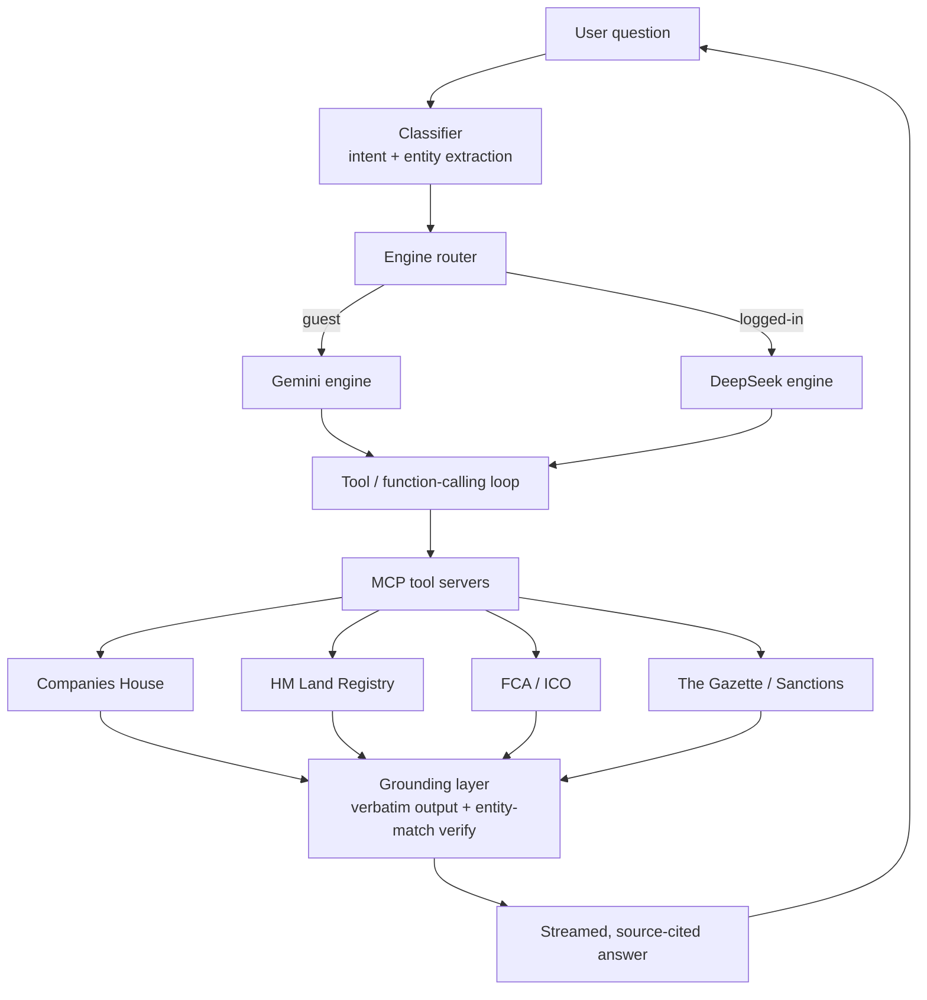

# Verivello — Architecture Case Study

> **How I ground an LLM in official UK registers to produce company-research answers with traceable sources.**

This is a public, code-free architecture write-up of **[Verivello](https://verivello.org)** — a live, production AI agent I designed and built. Ask it anything about any UK company and it returns a plain-English, **source-cited** answer drawn from official registers (Companies House, HM Land Registry, FCA, The Gazette, sanctions lists).

The product is proprietary, so this repo shares the **engineering thinking and system design** — the parts a hiring team actually wants to evaluate — without any product source or secrets.

**Live:** https://verivello.org · **Author:** Azeem Javed ([LinkedIn](https://www.linkedin.com/in/azeem-javed-7666861a/))

---

## The problem

LLMs are fluent but confidently wrong. For company due-diligence, a wrong director, ownership figure or sanctions status is worse than no answer. Companies House alone publishes millions of filings across a dozen registers, all raw. The goal:

> Let a user ask a natural-language question about any UK company and get an answer that is **fast**, **plain-English**, and **traceable to retrieved records**, with explicit uncertainty when evidence is missing.

---

## System at a glance



---

## Grounding and entity-verification design

Two rules do most of the work:

**1. Verbatim tool output, not model memory.**
The intended contract is that company facts come from retrieved records, rather than model memory. Tool output is supplied as evidence, and factual assertions should cite the records that support them. This design still requires evaluation of generated answers. The model's job is to *explain and cite* retrieved records, not to *know* them.

**2. Entity-match verification.**
Name-search APIs happily return *a* company for a query — often the wrong one. Before any record is used, it is re-verified against the queried entity (number, exact/normalised name, incorporation date). Mismatches are dropped, not shown. Illustrative shape (not product code):

```js
// Reject records that don't actually match the entity the user asked about.
function verifyMatch(query, record) {
  if (query.companyNumber)
    return Boolean(record.companyNumber) && query.companyNumber === record.companyNumber;      // strongest signal
  const a = normalise(record.name), b = normalise(query.name);
  return a === b || (similarity(a, b) >= 0.92 && sameIncorporationYear(query, record));
}
// Only verified records are allowed into the grounded context.
const grounded = toolResults.filter(r => verifyMatch(query, r));
```

The intended behavior is to abstain when nothing verifies. A source failure should be distinguished from a verified no-match result. The public write-up does not establish how often the deployed product follows this contract.

---

## Key components

| Layer | Responsibility |
|-------|----------------|
| **Classifier** | Extracts intent + the target entity from the question |
| **Engine router** | Picks the response engine per audience (guest vs. logged-in) |
| **Tool / function-calling loop** | Lets the model request exactly the data it needs |
| **MCP tool servers** | Expose each official register as a typed [Model Context Protocol](https://modelcontextprotocol.io) tool (see my companion repo [mcp-uk-tools](https://github.com/cavitnation/mcp-uk-tools)) |
| **Grounding layer** | Verbatim pass-through + entity-match verification |
| **Streaming** | Server-Sent Events so answers render as they generate |
| **Entitlements & billing** | Plan-gated tools/features, Stripe subscriptions with webhook reconciliation |

---

## Engineering decisions worth calling out

- **Grounding over fine-tuning.** Registers change daily; retrieval + verification can incorporate newer records without retraining; freshness still depends on source availability and cache policy.
- **MCP as the tool boundary.** Each data source is an independent, testable tool server — swappable and reusable across clients (Claude Code, Claude Desktop, the product itself).
- **Per-audience engine routing.** Different cost/quality trade-offs for anonymous vs. paying users, behind one interface.
- **Fail closed.** No verified record → abstain or explain source unavailability; do not present a plausible match as verified. In due diligence, a confident wrong answer is the expensive failure mode.
- **Agentic-first delivery.** Built by directing AI coding agents (Claude Code, Antigravity) while I own the architecture, specs, guardrails and review.

---

## Tech stack

PHP · Node.js · Python · SQLite / MySQL · Server-Sent Events · Model Context Protocol (MCP) · LLM function/tool calling · RAG grounding · Stripe · Linux · Cloudflare

---

## Related

- **[mcp-uk-tools](https://github.com/cavitnation/mcp-uk-tools)** — an open, keyless MCP server (with tests + CI) demonstrating the tool-server pattern used here.

## Evaluation boundary

An explicit company number must match a returned identifier; a missing or conflicting identifier must not fall back to a similar name. Name-only queries can be ambiguous even when names and incorporation years resemble each other. Ask for clarification instead of treating a similarity threshold as proof.

Retrieved records are untrusted evidence, not instructions. Test that instruction-like text in a filing cannot override citation, authorization or tool-use rules. Distinguish source outages, stale evidence, multiple matches and an authoritative no-match response.

The [evaluation fixtures](evals/README.md) define a small synthetic output contract and a deterministic scorer. They are a starting point for connecting a private product adapter, not a benchmark of the deployed model. No measured hallucination rate, citation-accuracy percentage, response latency or cost is published here yet.

For a production evaluation, capture the model/version, prompt revision, tool results and timestamps, then measure supported facts, correct entity selection, appropriate abstention, p50/p95 latency and cost per task. Human review is still required for semantic support and difficult entity cases.

*This repository contains an architecture write-up and synthetic evaluation fixtures. It contains no proprietary product implementation, credentials or customer records.*
